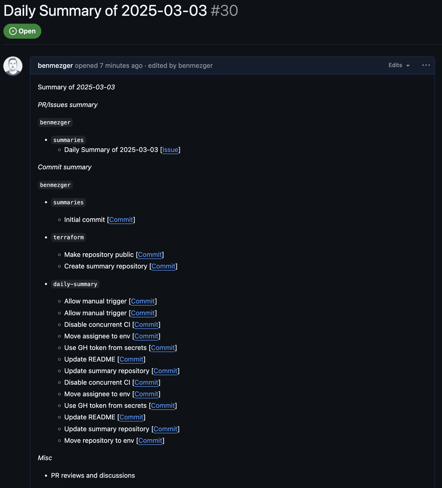

# Daily Summary

Generate daily GitHub summaries of newly created pull requests (PRs) and
commits, categorized by organization. Optionally, use `Ollama` to generate a brief
summary of each PR based on its title. Additionally, you can leverage the
[daily](./.github/workflows/daily.yaml) GitHub workflow to automate the tool’s
execution, submitting the report as a GitHub issue.

## Requirements
1. Ollama installed
2. Ollama `mistral` model (_optional_)
3. Python + UV

## Creating a Github token

`daily-summary` needs a Github token to fetch organization/user PRs and
commits. To create one, follow these steps:

1. Create a Github [token](https://github.com/settings/tokens/new) with the
   following permissions:
    1. `repo` -> Check all
    2. `admin:org` -> Check `read:org`
    3. `user` -> Check all
2. Authorize the token if your organization has SAML enabled. Follow this
   [guide](https://docs.github.com/en/enterprise-cloud@latest/authentication/authenticating-with-saml-single-sign-on/authorizing-a-personal-access-token-for-use-with-saml-single-sign-on) for instructions

## Installing

To install run:

``` sh
uv sync
```

To check if its properly installed:

``` sh
uv run task cli --help
```

## Usage

Ensure your GitHub token is available in your environment as `GITHUB_TOKEN`, or
provide the token as a parameter to the command using:

``` sh
uv run task cli --token <GITHUB_TOKEN> ...
```

### Generate daily summaries based on PRs and commits
This will default to today's date.

``` sh
uv run task cli daily-summary
```

### Generate daily summaries based on PRs and commits from yesterday

``` sh
uv run task cli daily-summary --yesterday
```

### Generate daily summaries based on PRs and commits for a specific date

``` sh
uv run task cli daily-summary --date 2025-02-28
```

### Generate daily summaries based on PRs and commits for a particular username

``` sh
uv run task cli --username github-bot daily-summary
```

### List today's PR

``` sh
uv run task cli list-issues
```

### List PRs from a specific date

``` sh
uv run task cli list-issues --date 2025-02-28
```

### List commits from a specific date

``` sh
uv run task cli list-commits --date 2025-02-28
```

### Showing account details

``` sh
uv run task cli account
```

### Other usages
For more usages, use:

``` sh
uv run task cli --help
```


## Using the Github workflow

1. Fork the repository
2. Follow the steps shown in section [Creating a Github token](#creating-a-github-token)
3. Add the newly created token to your CI secrets as `GH_TOKEN`. See this
   [guide](https://docs.github.com/en/actions/security-for-github-actions/security-guides/using-secrets-in-github-actions#creating-secrets-for-a-repository)
   for more details
4. Update the GitHub [workflow](./.github/workflows/daily.yaml) configuration:
    * Replace the values of `SUMMARY_REPOSITORY` and `SUMMARY_ASSIGNEE` in the
      environment variables with your summary repository and assignee.

### Screenshot

